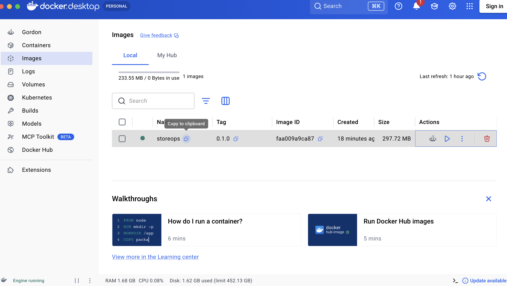
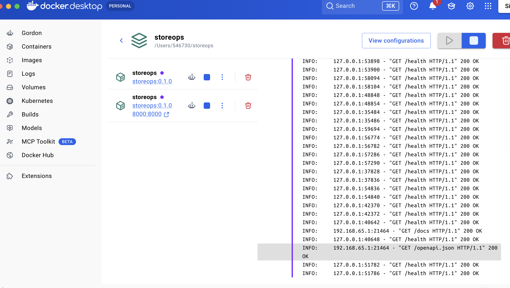
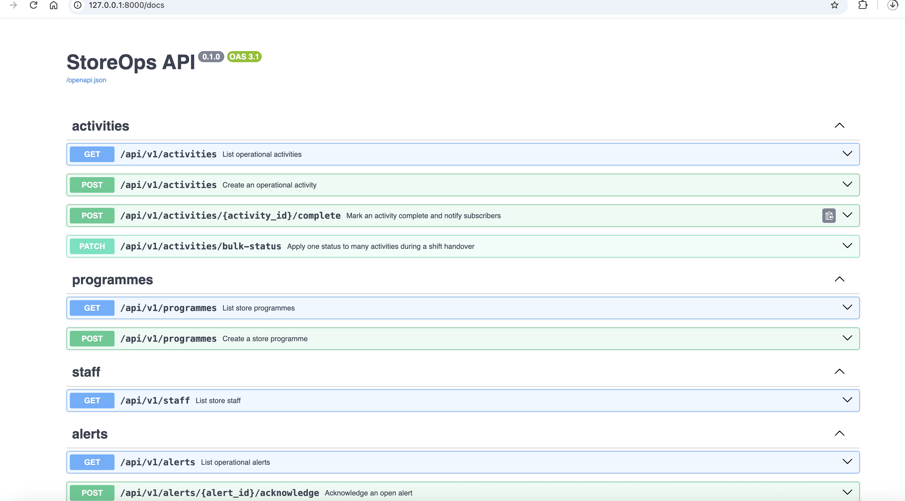
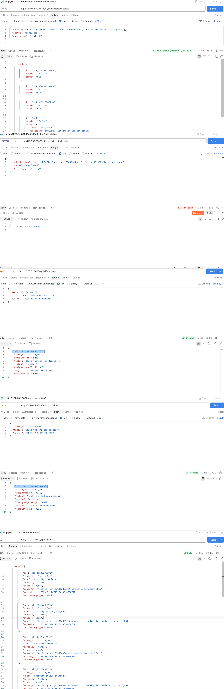

# Deployment — StoreOps API

Deployment target: **local Docker**, via `docker compose` (case-study §3.4,
option 1). The application was deployed and the feature produced by the harness
run was called against the running container.

## Target and tooling

| | |
| --- | --- |
| Target | Local Docker Desktop on macOS (arm64) |
| Docker | `Docker version 29.8.0, build 88096ef` |
| Compose | `Docker Compose version v5.5.1` |
| Image | `storeops:0.1.0 298MB` |
| Base image | `python:3.11-slim` |
| Container | `storeops-api`, port 8000 → 8000 |

## Files

- [`Dockerfile`](Dockerfile) — two stages. The build stage installs the project
  into `/opt/venv`; the runtime stage copies only that venv, so no build
  backend or wheel cache ships in the final image. Runs as an unprivileged
  `storeops` user. No writable volume is needed because StoreOps repositories
  are in-memory by design.
- [`compose.yaml`](compose.yaml) — one service, no database. A `HEALTHCHECK`
  polls `/health`, which is unprefixed and touches no module state, so it is a
  true liveness probe rather than a smoke test of the API surface.
- [`.dockerignore`](.dockerignore) — excludes `.venv/`, `tests/`,
  `.harness/output/` and the caches.

## Steps taken

```bash
# 1. build
docker compose build

# 2. start, detached
docker compose up -d

# 3. wait for the healthcheck to report healthy (~6s)
docker inspect --format='{{.State.Health.Status}}' storeops-api

# 4. confirm
docker compose ps
```

Result:

```
NAME           STATUS                   PORTS
storeops-api   Up 5 seconds (healthy)   0.0.0.0:8000->8000/tcp
```

## Environment configuration

Set in both the Dockerfile and `compose.yaml`:

| Variable | Value | Effect |
| --- | --- | --- |
| `STOREOPS_ENV` | `container` | Read by `core/config.get_settings()`. Anything other than `local` makes `Settings.debug` false. |
| `STOREOPS_API_PREFIX` | `/api/v1` | The REST prefix. |
| `PYTHONUNBUFFERED` | `1` | Logs reach `docker logs` immediately. |

No secrets are involved. There is no database, no external service and no
credential, because the reference application stores everything in memory.

## Verification — the new endpoint responding in the deployed container

The feature the harness produced is `PATCH /api/v1/activities/bulk-status`.

```bash
curl -X PATCH http://127.0.0.1:8000/api/v1/activities/bulk-status \
  -H 'Content-Type: application/json' \
  -d '{
        "activity_ids": ["<id1>", "<id2>", "<id3>", "<already-completed-id>", "act_ghost"],
        "status": "completed",
        "updated_by": "staff_001"
      }'
```

Response — `HTTP 207`:

```json
{
  "results": [
    { "id": "act_c42c69c42b26", "result": "updated", "error": null },
    { "id": "act_9e95eb80fd01", "result": "updated", "error": null },
    { "id": "act_b2bd65bbe67e", "result": "updated", "error": null },
    { "id": "act_58e666e7e603", "result": "failed",
      "error": { "code": "conflict",
                 "message": "Activity 'act_58e666e7e603' is completed and may not become completed." } },
    { "id": "act_ghost", "result": "failed",
      "error": { "code": "not_found",
                 "message": "activity 'act_ghost' was not found." } }
  ],
  "updated": 3,
  "failed": 2
}
```

All three sprint outcomes are visible in that one response: partial application
(sprint 1), a per-item `conflict` from the transition rules (sprint 2), and a
per-item `not_found`.

### The audit trail, proving the module boundary holds

`GET /api/v1/alerts` immediately afterwards:

```
audit entries (kind = activity.status_changed), grouped by actor:
   staff_001:   3      <- the batch above updated exactly 3 activities
   staff_early: 1      <- an earlier setup call updated 1
```

```
info | Activity act_b2bd65bbe67e moved from pending to completed by staff_001.
info | Activity act_9e95eb80fd01 moved from pending to completed by staff_001.
info | Activity act_c42c69c42b26 moved from pending to completed by staff_001.
```

Exactly one entry per **successfully updated** activity. The conflicted item and
the nonexistent id produced none.

These entries were written by the `alerts` module, which `activities` never
imports. Verified by parsing the AST of every file under
`src/storeops/modules/activities/`:

```
import statements referencing alerts: NONE — Rule 2 upheld
```

(A naive `grep "import.*alerts"` reports a false positive, because
`service.py:191` carries the comment
`# Boundary rule: notify via the bus, never by importing alerts.`)

## Evidence

### 1. Image built



Docker Desktop → Images. `storeops:0.1.0`, image id `faa009a9ca87`, 297.72 MB,
built from the two-stage [`Dockerfile`](Dockerfile).

### 2. Container running and healthy



Docker Desktop → the `storeops` compose project. The container is up with
`8000:8000` published, and the log pane shows the `HEALTHCHECK` polling
`GET /health` and receiving `200 OK` on a 10-second interval, plus the
`GET /docs` and `GET /openapi.json` requests from the browser session below.

### 3. The new endpoint present in the deployed OpenAPI schema



`http://127.0.0.1:8000/docs` served by the container.
**`PATCH /api/v1/activities/bulk-status` — "Apply one status to many activities
during a shift handover"** is the endpoint the harness generated. It appears
alongside the nine pre-existing endpoints, making ten in total, which is the
change sprint 1 had to make to
`test_boundaries.py::test_api_exposes_exactly_the_expected_endpoints`.

### 4. The endpoint responding — the primary evidence



Captured in Postman against the running container. Reading top to bottom:

**The handover call.** `PATCH http://127.0.0.1:8000/api/v1/activities/bulk-status`
with three real activity ids and one deliberately invalid id:

```json
{
  "activity_ids": ["act_1de3e71a90ce", "act_30a40e09aaeb",
                   "act_ae1316803ff4", "act_ghost"],
  "status": "completed",
  "updated_by": "staff_001"
}
```

Response: **`207 Multi-Status (WebDAV) (RFC 4918)`**, 357 ms, 462 B. Three items
return `"result": "updated"` with `"error": null`; `act_ghost` returns
`"result": "failed"` with `"code": "not_found"` and
`"message": "activity 'act_ghost' was not found."`

That single response demonstrates the whole feature: **partial application** —
the batch was neither rejected wholesale nor silently truncated. This is
sprint 1's AC-1.4 satisfied in a deployed container.

**Setup calls.** Two `POST /api/v1/activities/` requests returning `201 Created`,
supplying the ids used above. Note `"due_at": "2026-12-31T09:00:00Z"` — a future
date, because `ActivityService.create` raises `ValidationError` for a past one.

**The audit trail.** `GET /api/v1/alerts` → `200 OK`, 3.6 KB. Each completed
activity produced **two** entries, which is deliberate:

| `kind` | Message | Purpose |
| --- | --- | --- |
| `activity.status_changed` | "Activity act_ae1316803ff4 moved from pending to completed by staff_001." | The handover audit record (sprint 3) |
| `activity.completed` | "Activity act_ae1316803ff4 completed by staff_001." | The pre-existing completion notification, preserved by AC-3.3 |

Both were written by the `alerts` module reacting to events on the bus.
`activities` does not import `alerts` anywhere — these entries are the runtime
proof that the module boundary held while the side effect still crossed it.

**One panel needs explaining.** The second request in the capture returns
`404 Not Found` with body `{"detail": "Not Found"}` — an earlier attempt with a
malformed URL, before the correct path was used. It is worth noting *why* the
body differs: an unmatched route is rejected by Starlette's router before any
StoreOps handler runs, so it returns FastAPI's default `{"detail": ...}` shape
rather than the `{"error": {"code": ...}}` envelope that
`AppError.to_payload()` produces. Every error raised by StoreOps code uses the
envelope; only "no such route" does not.

## Operating the container

```bash
docker compose up -d          # start
docker compose ps             # status and health
docker compose logs -f        # follow logs
docker compose down           # stop and remove
```

## Notes and limitations

- **State is in memory.** Every restart empties all activities, programmes and
  alerts. This is deliberate in the reference application, and it is why the
  container needs no volume and the compose file needs no database service.
- **Docker CLI was not on PATH.** Docker Desktop was installed and running, but
  its CLI and credential helpers were not linked. They were symlinked from
  `/Applications/Docker.app/Contents/Resources/` into `~/.local/bin` and
  `~/.docker/cli-plugins`. Without `docker-credential-desktop` on PATH, the
  build fails at `load metadata` with `error getting credentials`.
- **Corporate TLS interception.** The network re-signs TLS with a CA that tools
  bundling their own cert store reject. `uv` needed `--system-certs` to
  install Python 3.11. Docker was unaffected, but a cloud deployment from this
  machine would likely need the same treatment.
- **Cloud deployment was not attempted.** §3.4 recommends it for the AI Platform
  Services competency. Local Docker is an accepted option and is what is
  demonstrated here.
